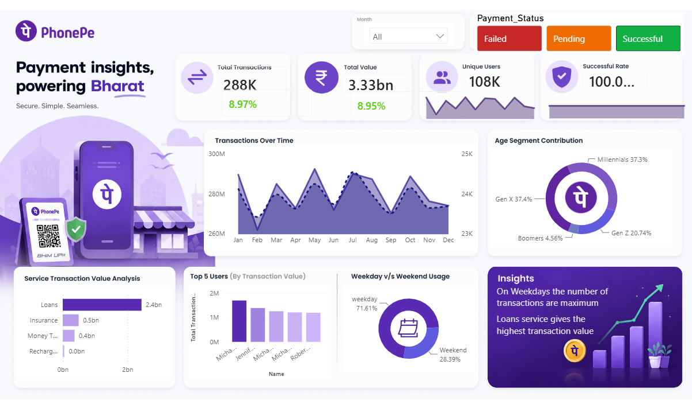

# 📊 PhonePe Data Analytics Project | Power BI

<p align="center">


</p>

---

## 📌 Project Overview

This project presents an interactive **PhonePe Data Analytics Dashboard** developed using **Microsoft Power BI** to analyze digital payment transactions, customer behavior, service performance, and payment outcomes.

The project demonstrates an end-to-end analytics workflow involving **data preparation, Power Query transformations, data modeling, DAX-based KPI development, interactive visualization, and business insight generation**.

The dashboard enables users to explore transaction patterns across different services, customer segments, payment statuses, time periods, and usage behaviors.

> **Dataset Note:** The project uses a synthetic/educational dataset for portfolio and learning purposes. It does not contain confidential or internal PhonePe data.

---

## 🎯 Business Objectives

The dashboard is designed to answer key business questions such as:

* How are transaction volumes and values changing over time?
* What is the overall payment success rate?
* Which services contribute the highest transaction value?
* How does transaction behavior differ across customer age groups?
* How do weekday and weekend transaction patterns compare?
* Which users contribute significantly to transaction activity?
* What are the major reasons associated with unsuccessful payments?
* How can transaction data be used to identify business performance patterns?

---

## 📊 Dashboard Highlights

### Key Performance Indicators

* Total Transactions
* Total Transaction Value
* Unique Users
* Payment Success Rate

### Interactive Analysis

* 📈 Monthly Transaction Trends
* 💳 Payment Status Analysis
* 💰 Service-wise Transaction Performance
* 👥 Age Segment Analysis
* 🏆 Top User Analysis
* 📅 Weekday vs. Weekend Behavior
* 🔎 Dynamic Slicers and Filtering
* 📊 Business Insight Analysis

---

## 🔍 Key Insights

The dashboard provides analysis of:

* Transaction volume and value across different time periods
* Payment success and failure patterns
* Service-wise contribution to transaction value
* Customer participation across age segments
* Differences between weekday and weekend usage
* High-contributing users and transaction activity
* Service and payment performance patterns

The interactive dashboard allows these insights to be explored dynamically using filters and slicers.

---

## 🗂️ Dataset

The project uses two Excel datasets containing user and transaction-level information.

### User Data

The user dataset contains fields such as:

* `User_ID`
* `Name`
* `Age`
* `Join_Date`

### Transaction Data

The transaction dataset contains:

* `Transaction_ID`
* `Amount`
* `User_ID`
* `Service`
* `Service Type`
* `Payment_Status`
* `Reason`
* `Date`

The primary transaction dataset contains approximately **300,000 transaction records**, while the user dataset contains approximately **107,000 users**.

---

## 🛠️ Tools & Technologies

* **Microsoft Power BI** — Dashboard development and visualization
* **DAX** — Measures, KPIs, and analytical calculations
* **Power Query** — Data cleaning and transformation
* **Microsoft Excel** — Source data and data preparation
* **Data Modeling** — Structuring relationships between analytical entities

---

## ⚙️ Analytics Workflow

```text
Excel Dataset
      ↓
Data Exploration
      ↓
Power Query Transformation
      ↓
Data Modeling
      ↓
DAX Measures & KPIs
      ↓
Interactive Power BI Dashboard
      ↓
Business Insights
```

---

## 📈 Skills Demonstrated

* Data Cleaning & Preparation
* Power Query Transformations
* Data Modeling
* DAX Measures
* KPI Development
* Interactive Dashboard Design
* Time-Series Analysis
* Customer Segmentation
* Transaction Analysis
* Business Intelligence
* Data Visualization
* Business Insight Generation

---

## 🖼️ Dashboard Preview



---

## 📁 Repository Structure

All project files are maintained directly in the repository root for easy access.

```text
phonepe-data-analytics/
│
├── phonepe-data-analysis-powerbi.pbix
├── phonepe_dataset_1.xlsx
├── phonepe_dataset_2.xlsx
├── dashboard-preview.png
└── README.md
```

---

## 🚀 How to Explore the Project

1. Download the `.pbix` Power BI file.
2. Open it using **Microsoft Power BI Desktop**.
3. Use the available slicers and filters to explore the dashboard.
4. Navigate through the visualizations to analyze transaction, customer, service, and payment trends.
5. Review the underlying Excel datasets to understand the source data structure.

---

## 💡 Potential Future Enhancements

* Add advanced customer segmentation
* Introduce additional financial and operational KPIs
* Develop drill-through analysis pages
* Add automated data refresh
* Extend the analysis with predictive analytics
* Publish and monitor the dashboard through Power BI Service


---

⭐ If you found this project useful, feel free to explore the repository and share your feedback.
